# Gomoku

## 基本介绍

五子棋游戏(Gomoku), GUI通过Qt实现，如图所示：

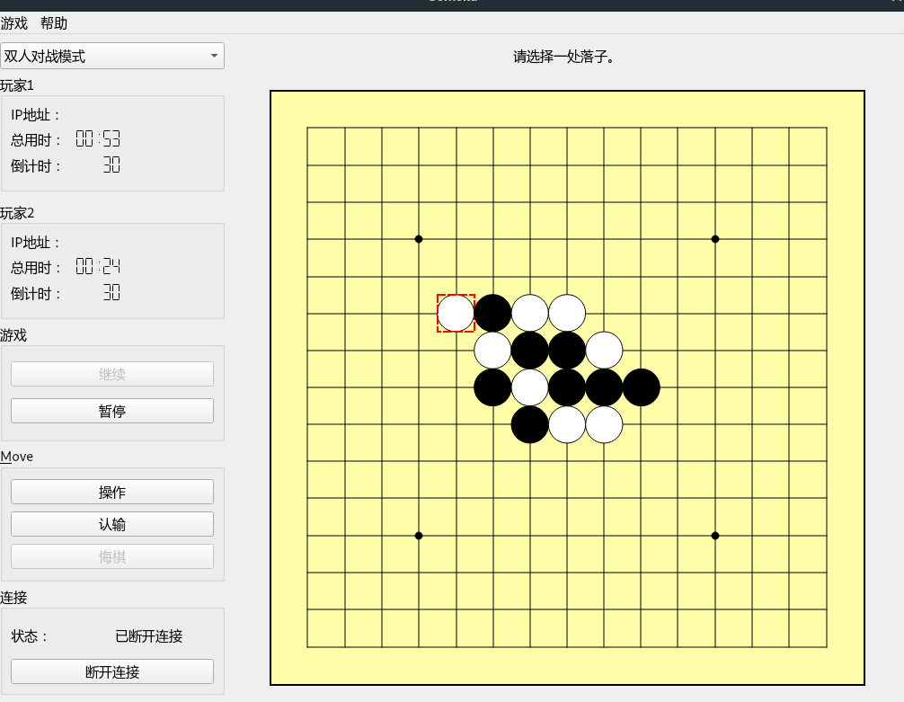

游戏支持以下模式：
- Single Mode
    双人对战模式，支持在同一台电脑上两人对战。
- Network Mode
    网络对战模式，支持用户通过网络连接对战，只需要知道IP即可。
- AI Mode
    人机对战模式，支持AI对战。

## 棋型确定

| 棋型     | 定义                                                     | 图例                                                         |
| -------- | -------------------------------------------------------- | ------------------------------------------------------------ |
| **长连** | 至少五颗同色棋子连在一起                                 | 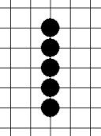                 |
| **活四** | 有两个连五点（即有两个点可以形成五），图中白点即为连五点 | 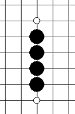                 |
| **冲四** | 有一个连五点                                             | 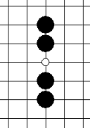 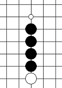 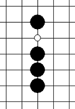 |
| **活三** | 可以形成活四的三                                         | 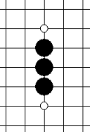  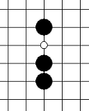 |
| **眠三** | 只能够形成冲四的三                                       | 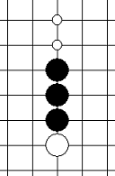   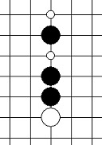  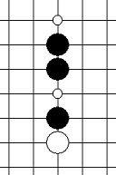  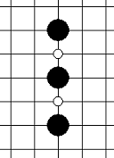 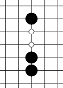 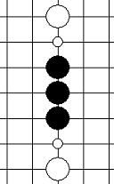 |
| 活二     | 能够形成活三的二                                         | 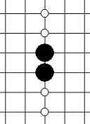 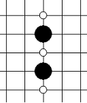 |
| 眠二     | 能够形成眠三的二                                         | 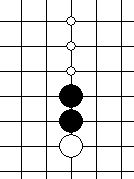 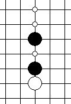 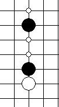 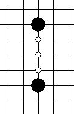 |
| 死四     | 两头都被封堵的四                                         |                                                              |
| 死四     | 两头都被封堵的三                                         |                                                              |


## 落子估值方式

### 分析：棋子落在哪里最好？

1. 需要考虑落下后会在四个方向各形成什么棋型，是否形成组合棋型，然后进行初步打分；
2. 同时还要考虑落子位置，一般同分情况下越中心的点越好；
3. 可以分析对攻击效果、防守效果、综合效果。

### 初步打分：

就是按照威胁程度给每种棋型打分，在理解棋型后，试验了多组估分方式，最后确定效果最好的一组打分方式如下：

| 棋型（含组合棋型） | 分值   |
| ------------------ | ------ |
| 长连               | 100000 |
| 活4、双冲4、冲4活3 | 10000  |
| 双活3              | 5000   |
| 活3眠3             | 1000   |
| 眠4                | 500    |
| 活3                | 200    |
| 双活2              | 100    |
| 眠3                | 50     |
| 活2眠2             | 10     |
| 活2                | 5      |
| 眠2                | 3      |
| 死4                | -5     |
| 死3                | -5     |
| 死2                | -5     |

再统计在四个方向各形成什么棋型，是否形成组合棋型，取最高分为初步打分的结果。

### 落子位置

根据棋盘分布问题，越中心的点分值应当越高。

```c++
static int[][] position = {
{ 0, 0, 0, 0, 0, 0, 0, 0, 0, 0, 0, 0, 0, 0, 0 },
{ 0, 1, 1, 1, 1, 1, 1, 1, 1, 1, 1, 1, 1, 1, 0 },
{ 0, 1, 2, 2, 2, 2, 2, 2, 2, 2, 2, 2, 2, 1, 0 },
{ 0, 1, 2, 3, 3, 3, 3, 3, 3, 3, 3, 3, 2, 1, 0 },
{ 0, 1, 2, 3, 4, 4, 4, 4, 4, 4, 4, 3, 2, 1, 0 },
{ 0, 1, 2, 3, 4, 5, 5, 5, 5, 5, 4, 3, 2, 1, 0 },
{ 0, 1, 2, 3, 4, 5, 6, 6, 6, 5, 4, 3, 2, 1, 0 },
{ 0, 1, 2, 3, 4, 5, 6, 7, 6, 5, 4, 3, 2, 1, 0 },
{ 0, 1, 2, 3, 4, 5, 6, 6, 6, 5, 4, 3, 2, 1, 0 },
{ 0, 1, 2, 3, 4, 5, 5, 5, 5, 5, 4, 3, 2, 1, 0 },
{ 0, 1, 2, 3, 4, 4, 4, 4, 4, 4, 4, 3, 2, 1, 0 },
{ 0, 1, 2, 3, 3, 3, 3, 3, 3, 3, 3, 3, 2, 1, 0 },
{ 0, 1, 2, 2, 2, 2, 2, 2, 2, 2, 2, 2, 2, 1, 0 },
{ 0, 1, 1, 1, 1, 1, 1, 1, 1, 1, 1, 1, 1, 1, 0 },
{ 0, 0, 0, 0, 0, 0, 0, 0, 0, 0, 0, 0, 0, 0, 0 } };
```

## 棋局估值函数

### 函数描述：

有了落子估值方式后，可以针对某一棋局，分析一定棋盘范围内的各个可落子点的落子估值，将最大综合分作为该棋局的估值。

### 简单智能:

利用估值函数，即可实现简单智能，即只考虑当前局面下的最佳落子点，并落子。

优点是速度快，眼前胜利绝不放过，缺点也是显而易见的，对于埋伏了多步的杀法，这种只顾“近忧”的智能无能为力。因此，就需要搜索算法增加“远虑”。

## 搜索算法

计算机要选择有利于它的最佳下法，就要能够判断那种形式对自己最有利。为了判断哪种形式更有利，往往需要向后面计算几步，看看走了几步棋之后，局面的形式如何。五子棋的各种走法展开后，就形成了一棵巨大的博弈树。

### 极大极小搜索

在这个树中，从根节点为0开始，奇数层表示电脑可能的走法，偶数层表示玩家可能的走法。

假设电脑先手，那么第一层就是电脑的所有可能的走法，第二层就是玩家的所有可能走法，以此类推。

那么我们如何才能知道哪一个分支的走法是最优的，我们就需要一个**估值函数**能对当前整个局势作出评估，返回一个分数。我们规定对电脑越有利，分数越大，对玩家越有利，分数越小，分数的起点是0。

我们遍历这颗博弈树的时候就很明显知道该如何选择分支了：

- 电脑走棋的层我们称为MAX层，这一层电脑要保证自己利益最大化，那么就需要选分最高的节点。

- 玩家走棋的层我们称为MIN层，这一层玩家要保证自己的利益最大化，那么就会选分最低的节点。


这也就是极大极小值搜索算法的名称由来。如上图，图中甲是电脑，乙是玩家，那么在甲层的时候，总是选其中值最大的节点，乙层的时候，总是选其中最小的节点。

而每一个节点的分数，都是由子节点决定的，因此我们对博弈树只能进行深度优先搜索而无法进行广度优先搜索。深度优先搜索用递归非常容易实现，然后主要工作其实是完成一个估值函数，这个函数需要对当前局势给出一个比较准确的评分。

实现极大值极小值搜索，就是是一个DFS，伪代码如下：

```pascal
function minmax(board, depth)
	for move in board.getLegalMoves() do
        board.createMove( move );
        current = min( board );
        if current.getScore() > bestScoreSoFar then
        	bestScoreSoFar = current.getScore();
        	bestMove = current.getMove();
        board.resetMove( move );
   	return bestScoreSoFar;

function min( board, depth )
	if board.isTerminal() then
		return evaluate(board)
	else
		score = ∞
		for move in board.getLegalMoves() do
			board.createMove( move );
			result = max( board, depth-1 )
			board.resetMove( move );
			if (result < score)
            	score = result;
	return score;

function max( board, depth )
	if board.isTerminal() then
		return evaluate(board)
	else
		score = -∞
		for move in board.getLegalMoves() do
			board.createMove( move );
			result = min( board, depth-1 )
			board.resetMove( move );
			if (result > score)
            	score = result;
	return score;
```

但测试后发现该算法速度比较慢，对15×15的棋盘，搜索第一层有15×15=225个结点，第二层就约有15×15×15×15=50625个节点，完全是指数爆炸。

### α-β剪枝算法

在搜索的过程中，实际上有搜索很多点是多余的。经过α-β剪枝，可以极大的减少搜索的数量。在查阅资料的过程中，发现α-β剪枝算法是一个基础而经典的算法，还有很多风格、很多变式，值得深入学习。


## 编译安装

create build director.
```shell
mkdir build
qmake ..
make
```


## 怎么用AI

1. 每次Human下子之后，改变了board的状态，然后AI根据当前的状态，找到所有的可以下子的点（邻居），假设在对应的位置落子，查看棋盘中的模式，对应算出该点的分数，哪个分数大MAX下到哪（evaluate）。然后在
